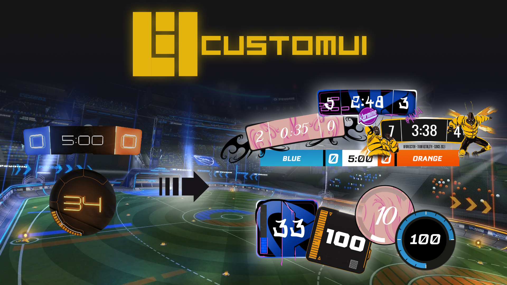

# Rocket League Plugin

## 🚀 Introduction  
[**CustomUI**](https://bakkesplugins.com/plugins/view/503) is a plugin that allows players to create and display their own custom user interface (UI) directly inside [**Rocket League**](https://www.rocketleague.com/fr). This plugin gives players the freedom to design unique visual elements by adding a personal touch to the interface.

## ✨ Features  
- **Easy to use**: Intuitive interface for configuring your designs.  
- **Full customization**: Modify images, colors, sizes, fonts, positions of UI elements.
- **Share creations**: Save and share your UI designs with the community.  

## 📦 Installation  

1. Download and install [**BakkesMod**](https://bakkesmod.com/) and the [**CustomUI plugin**](https://bakkesplugins.com/plugins/view/503).
2. Launch Rocket League and press **F3** to toggle the CustomUI window. (Alternatively, you can change the hotkey by pressing **F2**, navigating to **Plugins → CustomUI** in the BakkesMod settings, and assigning a different key.)
3. Select your **preset** and adjust the **size** and **position** to fit your preference.
4. Start a freeplay session or any game mode to view your custom UI in action.

## 📚 Full Documentation  
Join our [**Discord**](https://discord.gg/NQ8Qw4Mw2w) community to explore all available features, watch tutorials, and get support!  
  

#### Wiki:
- [Step-by-step guide](https://github.com/Joucaz/CustomUI/wiki/CustomUI-Tutorial)

#### Tutorial Videos:
- [How to use CustomUI](https://youtu.be/-xOmT7EfpgA)  
- [How to create your own preset](#)

## ❓ FAQ  
**Q: Can I use the plugin in all game modes within Rocket League?**  
A: Yes, the plugin is compatible with all match types in Rocket League. 

**Q: Can I share my UI designs with friends?**  
A: Yes, presets can be easily exported and imported.  

## ℹ️ Additional Information  
This plugin collects usage statistics, including user IDs, to track the number of users and the presets used. This data helps improve the plugin and provide better insights.

## 🔗 Links

### Presets Artists:
[Kisute](https://x.com/Kisute3) | [SucreDorge](https://x.com/SucreDorgePSD) | [Emmy](https://x.com/CaptainArteis) | [Krogezo](https://x.com/Krogezo) | [Tanderiz](https://x.com/Tanderiz)

### Thanks to:
[Arubinu42](https://twitch.tv/Arubinu42) | Vync | SoulDaMeep |

### Creator & Developer:

